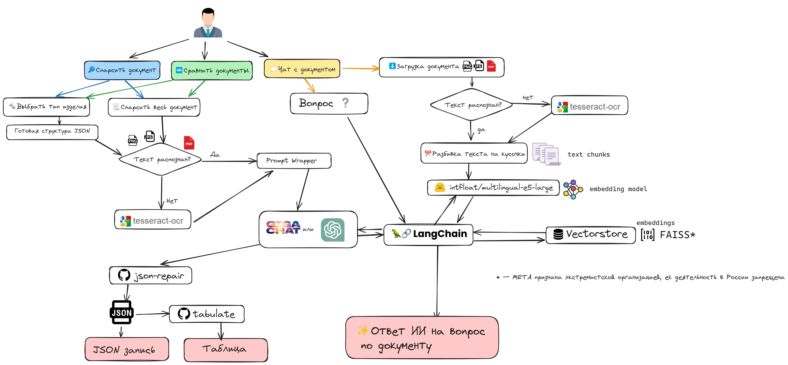

</a> </a>

Состав команды:

|ФИО | Роль|
|-|-|
| Баймлер Ярослав| CV Engineer |
| Вяткин Роман| Scrum master / MLOps|
| Ихматуллаев  Даврон| ML Engineer / Backend developer |
| Назаров Михаил | ML Engineer |
| Полякова Валерия| QA Engineer|
| Яськова Марина |Data Analyst |

## `Описание проблемы`

Сотрудники вручную ищут, собирают и перепечатывают информацию о товаре, что замедляет процесс вывода товара на полку и снижает информативность товарной базы.

## `Описание задачи`

На склад поступает много товаров, о которых нет информации в цифровом виде. Необходимо разработать сервис, который будет использовать загруженные изображения/сканы паспортов товаров как источник информации о них и переведет эту информацию в формат, пригодный для использования в карточке товара.

## `Требования к решению задачи`

- Проверяемая метрика – полнота извлекаемой информации
- Python версии 3.8+ и любые библиотеки с открытым исходным кодом
- Языковые модели: yandexgpt, gigachat и любые открытые LLM
- Допускается использование мультимодальных моделей и open-source
OCR библиотек
- Сервис, решающий данную задачу, упакован в Docker compose
- Работающий телеграм-бот

## `Этапы решения задачи`

1. Извлечение и предобработка текстовой инфрмации из паспортов
2. Создание запросов для суммаризации информации при помощи GigaChat
3. Разработка и размещение на сервере телеграмм-бота
4. Упаковка сервиса в Docker Container

## `Результат`

Результатом решения является разработанный телеграм-бот, который принимает отсканированное изображение паспорта изделия и возвращает технические характеристики.

## `Функциональная схема приложения`

Телеграмм-бот принимает на вход паспорт изделия в формате PDF или изображения и выполняет следующие функции по выбору пользователя:

1. Собирает технические характеристики изделия и предоставляет их в формате JSON.
2. Выполняет поиск информации в документе по запросу пользователя.
3. Принимает на вход документы двух изделий, сравнивает технические характеристики обоих изделий в удобной для пользователя форме таблицы.
