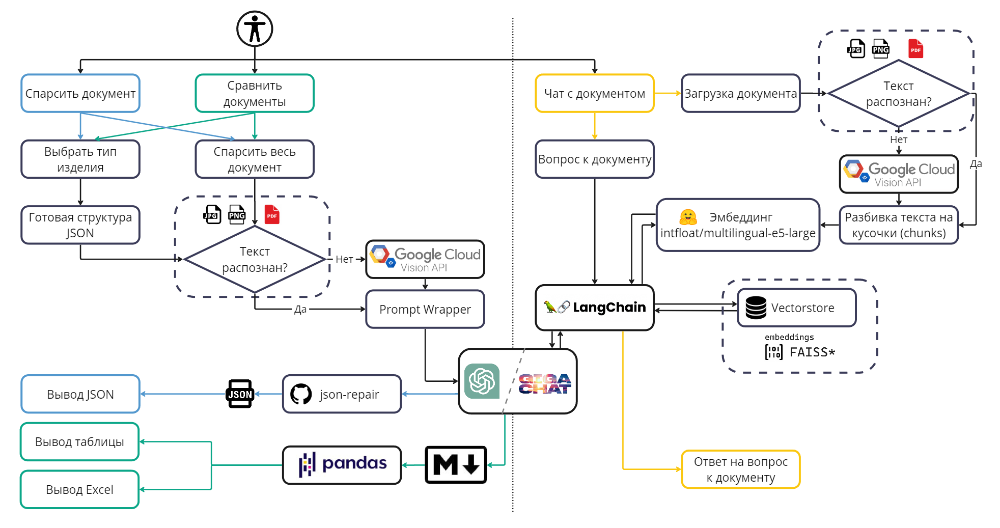
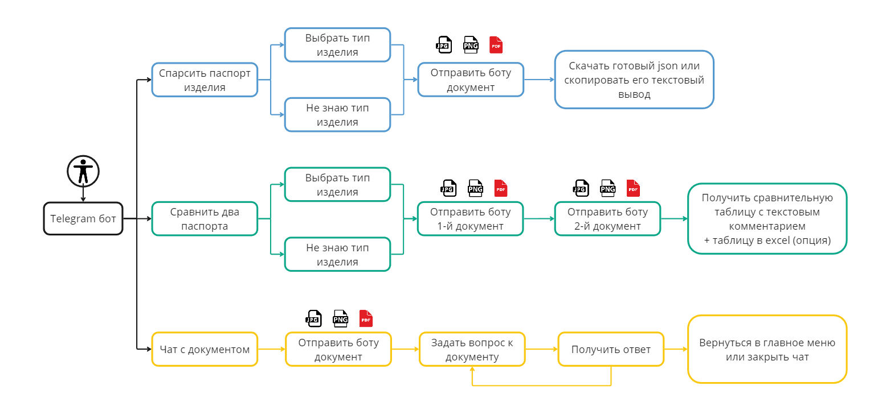

</a> </a>

Состав команды:

|ФИО | Роль|
|-|-|
| Баймлер Ярослав| CV Engineer |
| Вяткин Роман| Scrum master / MLOps|
| Ихматуллаев  Даврон| ML Engineer / Backend developer |
| Назаров Михаил | ML Engineer |
| Полякова Валерия| QA Engineer|
| Яськова Марина | Data Analyst / Prompt Engineer |

## `Описание проблемы`

Сотрудники вручную ищут, собирают и перепечатывают информацию о товаре, что замедляет процесс вывода товара на полку и снижает информативность товарной базы.

## `Описание задачи`

На склад поступает много товаров, о которых нет информации в цифровом виде. Необходимо разработать сервис, который будет использовать загруженные изображения/сканы паспортов товаров как источник информации о них и переведет эту информацию в формат, пригодный для использования в карточке товара.

## `Требования к решению задачи`

- Проверяемая метрика – полнота извлекаемой информации
- Python версии 3.8+ и любые библиотеки с открытым исходным кодом
- Языковые модели: yandexgpt, gigachat и любые открытые LLM
- Допускается использование мультимодальных моделей и open-source
OCR библиотек
- Сервис, решающий данную задачу, упакован в Docker compose
- Работающий телеграм-бот

## `Этапы решения задачи`

1. Извлечение и предобработка текстовой информации из паспортов
2. Создание запросов для суммаризации информации при помощи LLM
3. Разработка и размещение на сервере телеграм-бота
4. Упаковка сервиса в Docker Container

## `Результат`

В качестве решения разработан телеграм-бот, который принимает на вход паспорт изделия в формате PDF, JPG или PNG и выполняет следующие функции по выбору пользователя:
1. Собирает технические характеристики изделия и выводит их в формате JSON. JSON-документ также доступен для скачивания.
2. Принимает на вход паспорта двух изделий, сравнивает технические характеристики обоих изделий и возвращает результат сравнения в удобной для пользователя форме таблицы с текстовым комментарием. Таблицу также можно скачать как документ Excel.
3. Выполняет поиск информации в документе по запросу пользователя (диалог с документом).

## `Функциональная схема решения`



## `Путь пользователя`


## `Запуск системы`:

Вариант №1 
- Скачать образ контейнера (https://disk.yandex.ru/d/wP2pX5B7WvvAgA)
- Восстановление образа контейнера 
```bash
docker load -i  bot-image_v10.tar
```
- Запуск контейнера
```bash
docker run -it --name gpnbot -e BOT_TOKEN=xxx  -e GIGA_TOKEN=xxx -e HUGGINGFACEHUB_API_TOKEN=xxx  gpn_bot:v10
```

Вариант №2:
- Создать образ контейнера
```bash
docker build  -t gpn_bot:v10
```
- Запуск контейнера
```bash
docker run -it --name gpnbot -e BOT_TOKEN=xxx  -e GIGA_TOKEN=xxx -e HUGGINGFACEHUB_API_TOKEN=xxx  gpn_bot:v10
```